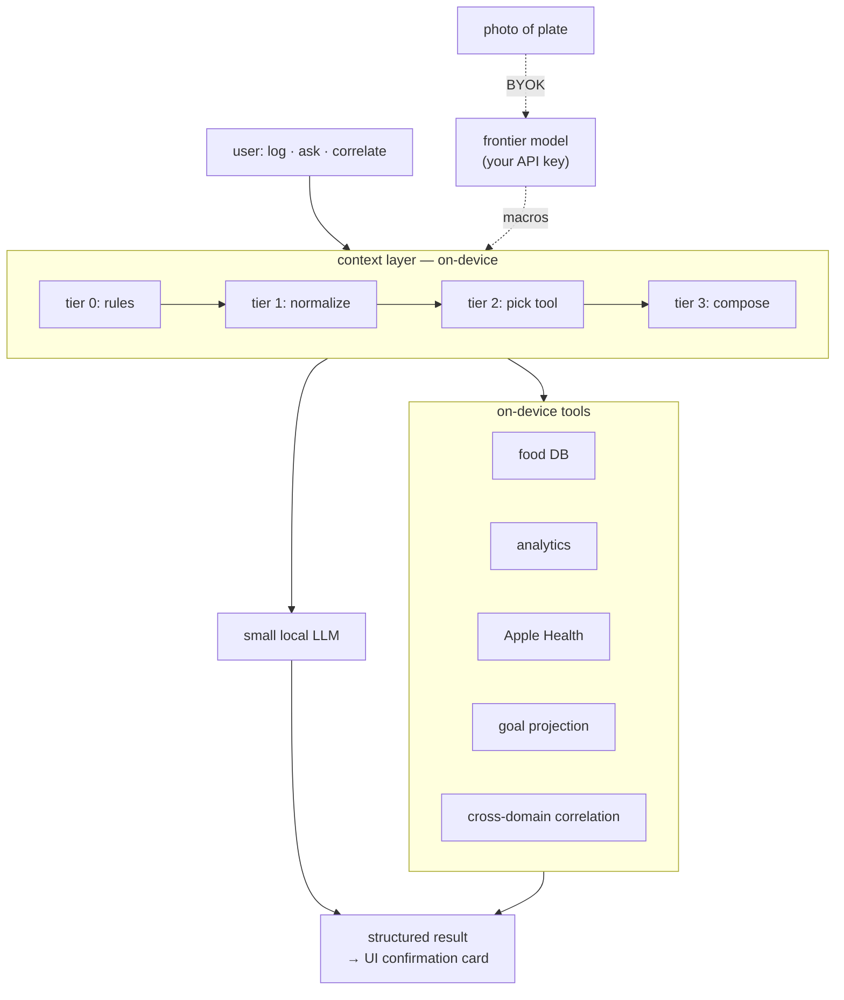
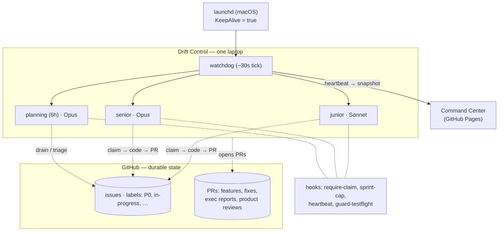

# The app that ships itself

*Notes on harness engineering for a one-person autonomous dev loop.*

---

If you know me, you know how much I geek out about health metrics — whether you asked or not. **Drift** is the hobby app I built because eight different health apps, each with its own subscription, could not between them answer a single useful question about my own data. A small language model runs on your phone, reads your Apple Health, and answers questions by chatting. No accounts, no subscription, no server on my end. Twenty-six phones now — friends and friends-of-friends — free and open source for everyone. I hope you try it — the public beta is [on TestFlight](https://testflight.apple.com/join/NDxkRwRq).

But this post isn't really about Drift. The interesting part is what built it.

I didn't want to sit with Claude Code in a chat window for months, vibe-coding until something shipped. I wanted a simple `while true` loop that would develop, test, and release the app on its own — with the kind of engineering discipline you'd expect from a real team. I've heard plenty of pitches about AI teams and AI engineers and multi-agent orchestras; I wanted the basics first. A loop that keeps going. A loop that builds its own harness.

### a quick Ralph primer

The technique has a name: the **Ralph loop**, popularized in late 2025 by [Geoffrey Huntley](https://ghuntley.com/ralph/). In its purest form it's a bash loop:

```
while :; do cat PROMPT.md | claude-code ; done
```

Named after the Simpsons character (persistent, sometimes simple-minded), Ralph restarts an AI coding agent with a fresh context on every iteration so it can't drift, forget, or hallucinate across a long project. Progress persists in files (`TRACKER.md`, `@AGENT.md`) and git commits — not in the model's memory — so the agent resumes work across sessions. It reads its own errors and fixes them. It can update its own instructions when it learns something new about the project, which is a lightweight form of recursive self-improvement. Huntley's framing: *"the technique is deterministically bad in an undeterministic world."* And it works with any coding agent that doesn't cap tool calls or usage.

Ralph is usually framed as overnight-work technology — a loop you run for a handful of hours while you sleep. My version has been running for months. The difference is the scaffolding around the loop.

I started one. My engineering time went not into the app but into that scaffolding. Over months it got sophisticated about its own engineering discipline. I seeded it with two personas — a Product Designer and a Principal Engineer — and across fifty-plus product reviews they grew into something that behaves like an experienced app developer and an experienced product manager. It learned from its mistakes, from my nudges, and from the feedback twenty-six beta users filed back. Releases are stable because the loop is simple and the harness around it is disciplined. (I try not to push every build — Ralph produces a few a day, and my dogfooders would get tired.)

What I've come to believe, after two weeks of watching it run mostly unattended: **human attention is the scarce resource, and the harness is where your taste actually lives.** Not in the model. Not in the prompt. In the scaffolding around the model — the gates that refuse bad tool calls, the reconciliation that doesn't trust session memory, the personas that compound taste, the dashboards I can read from my phone.

The harness isn't about autonomy. It's about *choosing where to spend attention*.

In the seven days before I sat down to write this, the harness pushed **409 commits** to Drift's repo, closed **30 bug issues** (most filed by real people on TestFlight, average close time around eleven minutes), and shipped **three TestFlight builds**. I wrote none of that code.

Two things live side by side in the rest of this post:

- **Drift** — the iOS app. The dish.
- **Drift Control** — the harness that builds Drift. The kitchen.

This is mostly about the kitchen.

---

## drift, briefly

Phones have finite memory, so the on-device model has to be small. A small model is not a smart model — but small models are reliably good at one thing: **tool calling**. Give them a clear toolbox; they read the query, pick the right tool, fill in its parameters, and return a structured result. That's the shape of almost every question a health app actually gets.

So Drift is roughly twenty tools, each a Swift function over one slice of data — food log, weight, workouts, Apple Health (including CGM glucose), goal projection, cross-domain correlation, trend projection. The model doesn't *do* the analysis; it picks the tool and routes the answer to the UI.



A small model given the right five facts behaves fine. Given twenty thousand tokens of noise it doesn't, and prompt-tweaking won't save it. The scaffolding does.

That's the app. The rest of this essay is about what builds it.

---

## the kitchen, one picture



A watchdog ticks every thirty seconds. When nothing is running, it spawns one of three session types: **planning** (Opus, every six hours), **senior** (Opus, complex work), **junior** (Sonnet, simpler tasks). Each session works one bounded unit and exits. Progress lives in git, not in the model's memory.

The scaffolding around that loop is five patterns, one per section below. Each came from a specific failure.

---

## 1 — ground truth, not memory

**The rule:** if a session wrote it, don't trust it stayed true. Reconcile every gate against the durable store — git log, GitHub API, the filesystem — never against session-written state.

I learned this the Saturday the watchdog ran eleven consecutive planning sessions in four hours and shipped nothing. Each session was supposed to write a stamp file when it finished. Each died before writing. The harness kept asking itself *when did I last plan?* and the answer was, forever, *never*.

Every gate in the loop now hits the durable store. More API calls. Worth it.

> Anti-patterns: read-then-claim in two calls; trusting in-memory state across a crash; a stamp file as the source of truth.

---

## 2 — hooks, not prose

**The rule:** the agent drifts from prose. Put the things that matter behind hooks that fail closed.

The most important hook in Drift Control is `require-claim`, a `PreToolUse` gate: if a session tries to `Edit` or `Write` without holding a GitHub issue labeled `in-progress`, the hook denies and the tool call never fires. It doesn't matter what the session read in the program file. It doesn't matter what it thought it was doing. The gate doesn't negotiate.

About fifteen hooks like that — queue cap, read-before-edit, TestFlight publishes — each under thirty lines of bash, each a chokepoint the session cannot route around.

Docs are hints. Hooks are law. When something breaks, I tighten a hook, not a prompt.

---

## 3 — atomic claim or nothing

**The rule:** read-and-claim must be one atomic operation. Peek-without-claim is a race.

Early on I watched a senior session spend twenty minutes "investigating" a task with no `in-progress` label. It crashed. Another session picked the same task up from scratch.

Fix: one script call that returns the next task *and* marks it in-progress under a single lock.

```bash
TASK=$(scripts/sprint-service.sh next --senior --claim)
```

Combined with `require-claim`, ghost work becomes mechanically impossible.

**End to end**, on an actual bug two days before I wrote this — issue **#220**. A beta user filed it from inside the app: *"Not able to edit ingredient list when I edit a recipe or meal from food diary."* Screenshot attached. `P0` label. Filed at `13:24:57` UTC.

Within thirty seconds the watchdog saw it. A senior session spawned, ran atomic claim, read the thread, posted a plan comment (required by hook), patched the view, ran tests, committed, pushed. Eleven minutes nineteen seconds later, at `13:36:16` UTC, GitHub's timeline shows the fix commit and the `in-progress → closed` transition, in that order.

That kind of close happens three to ten times a week on shallow bugs. The ones that don't close that fast are the ones that need design judgment or a product call — places where the bottleneck is me, not the loop. The harness ships what it can ship so my attention only has to show up for what actually requires it.

---

## 4 — tool calls are the pulse

**The rule:** measure liveness directly. Don't infer it from logs.

Log-file modification time lies. During long generation bursts — the model thinking for ninety seconds before a tool call — the log didn't move, and the watchdog kept killing sessions mid-thought.

The fix is three lines of bash, wired to every `PreToolUse` and `PostToolUse` hook:

```bash
#!/usr/bin/env bash
date +%s > ~/drift-state/session-heartbeat
echo "$(date +%s) $CLAUDE_TOOL_NAME" >> ~/drift-state/session-heartbeat.log
```

The watchdog reads that file — not the log — to decide liveness. Stale threshold: thirty minutes. Every ten minutes a snapshot script bucketizes the log into JSON and pushes. The Command Center, a static HTML page on GitHub Pages, renders it as an ECG strip:

```
Session heartbeat (last 4h)           Peak burst: 34 calls / 5 min
  ▁▁▁▂▂▃▄▅▅▆▇▇▆▅▄▃▂▁▁▁▂▃▄▅▆▇█▇▆▅▃▂▁▁▁▂
```

The heartbeat isn't for the harness — it's for me. It's the channel that lets me spend attention on what matters rather than on babysitting the loop.

*Caveat: thirty minutes is a timeout, not a fencing token. A wedged-alive session still holds its claim. On one laptop the atomic-claim-plus-hook combo is enough; a multi-host version would need real leases.*

**Every supervisor needs a supervisor.** The watchdog itself can crash. So it lives under a `launchd` plist with `KeepAlive=true` and `ThrottleInterval=30`. If it exits, launchd relaunches it within thirty seconds. The supervisor chain ends at the OS.

---

## 5 — the loop that fixes itself

The previous four patterns make the loop run unattended. This one is what makes it get *better* over time — and it's where the attention-scaling actually happens.

Every planning session drains issues labeled `process-feedback` into the backlog as `infra-improvement` tasks. Systemic problems — flaky tests, rate limits, patterns the model keeps repeating — become tickets the harness then works on. The harness patches itself.

Sharper: the **personas**. Two of them, seed files I wrote one afternoon: a Product Designer and a Principal Engineer. Every product review ends with a block titled *"What I Learned — Review #N,"* appended to the persona file. Fifty-four reviews in, those blocks have compounded into something that behaves like taste.

Review #11, two hundred cycles ago, surface-level:

> *"Spent too many cycles on blanket code refactoring instead of user-facing features. Merged into single autopilot loop."*

By Review #54, last week, the Designer is quoting competitive intel back at me:

> *"Whoop is now demonstrating exactly this pattern (Behavior Trends) to their 4M+ users. We built `cross_domain_insight` first — we have the pattern, the schema, and the service layer. Not shipping these two tools is a competitive mistake that compounds every cycle."*

The Engineer persona, same review, ends with what is effectively a mini-RFC:

> *"For `supplement_insight` and `food_timing_insight`: the AnalyticsService infrastructure from `cross_domain_insight` is already there — implementation is 1–2 new service query methods plus schema. This can ship in a single senior session if scoped correctly."*

It knows the codebase. It scopes the work. It predicts what will ship in one session. I have never hand-edited the Engineer persona. Every review stacks another paragraph of accumulated context onto the file.

And they *argue*. Each review has a *The Debate* block where the two personas disagree and converge:

> **Designer:** *"Every new task added today is a task that will be 2,000 cycles old before it ships. Hard rule: this planning session creates ≤4 new tasks."*
>
> **Engineer:** *"I support the spirit, but `program.md` requires 8+. There are two legitimate gaps in the queue…"*
>
> **Agreed Direction:** *"Queue cap of 70 re-affirmed. Execution drain rate is the only lever that matters."*

The review ends with *Decisions for Human* — three numbered questions pinned to me. I read them in bed, tap approve on one, reply "defer" on another. The next planning cycle picks them up. The personas converge on their own; only the irreducible decisions reach me.

I first heard about MyFitnessPal adding GLP-1 tracking from one of these product-review PRs, not from the tech press. That still sits oddly with me.

*Caveat: two samples from the same model aren't independent votes. The real next lever is letting beta-user A/B reactions become the eval — that piece is still half-built.*

---

## the dial I turn

There's no one lever. It's a dial with six settings:

| # | I do | Harness does |
|---|---|---|
| **0** | Close the laptop. | Reads roadmap, runs reviews, picks from its own backlog, ships on its own taste. |
| **1** | One-line comment on a review PR. | Treats it as a priority signal next planning. |
| **2** | Label an issue `design-doc`. | Writes a design doc on a branch, PRs it, waits for my comment. |
| **3** | File a `feature-request` with one paragraph. | Triages to sprint or defers. |
| **4** | File a `P0` bug. | Interrupts on next tick. Eleven minutes. |
| **5** | `echo PAUSE`, open Claude Code, type. | Stops spawning. `echo RUN` resumes. |

Counter-intuitively: the lighter the touch, the more the personas compound. Setting 2 — design-review request — is what I use for anything I actually care about shaping. Most of my product decisions now happen by reading a design PR and leaving two comments.

Which is the whole point. **The harness isn't about autonomy. It's about choosing where to spend attention.** The dial is how I choose.

---

## what's still broken

- **Parallelism.** Sessions fire one at a time on my laptop. `xcodebuild` hates concurrency. Will invert when throughput becomes the bottleneck.
- **Multi-repo.** I haven't ported the harness to a second project. Most of it should travel; some pieces will turn out to be load-bearing in ways I haven't noticed.
- **Independent voting.** Personas are correlated samples from the same model. Beta-user reactions are the real independent signal, but I still read them by hand. The next real move is letting a handful of A/B-tested user votes become the eval.
- **The ceiling.** Shallow bugs close while I sleep. Product direction calls still fall on me. The harness raised the floor; it hasn't raised the ceiling of what I can design awake.

---

## replicate it

Everything is zipped at [`drift-command-center-replicate.zip`](../drift-command-center-replicate.zip):

- `program.md` — the autopilot program the watchdog drives
- `.claude/settings.json` + `.claude/hooks/*.sh` — every enforcement hook
- `scripts/self-improve-watchdog.sh` — the watchdog
- `scripts/sprint-service.sh` + friends — state-machine CLIs
- `scripts/install-watchdog.sh` + `com.drift.watchdog.plist` — launchd supervision
- `command-center/` — the dashboard (static HTML/JS)

Cut and paste what you need, replace the Drift-specific bits, keep the shape. It's a kit, not a framework.

---

- Drift public beta: [testflight.apple.com/join/NDxkRwRq](https://testflight.apple.com/join/NDxkRwRq)
- Repository: [github.com/ashish-sadh/Drift](https://github.com/ashish-sadh/Drift)
- Ralph loop, original: [ghuntley.com/ralph](https://ghuntley.com/ralph/) — the engine comes from here
