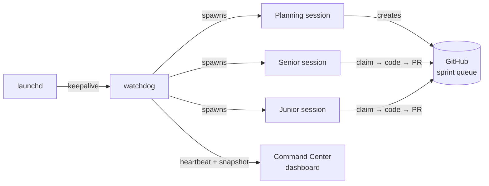
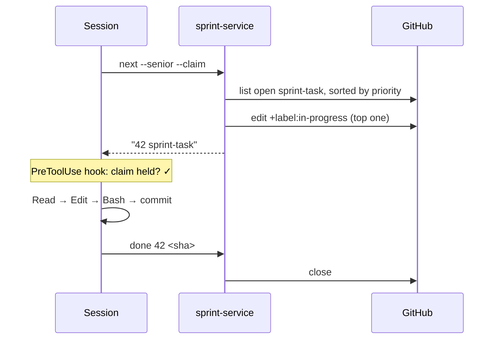
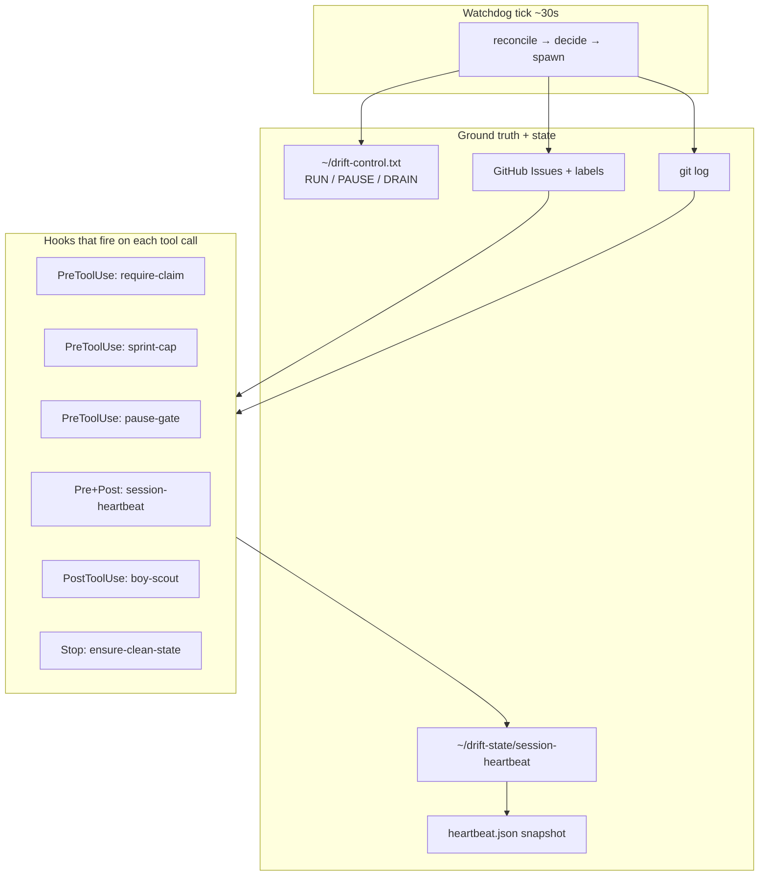

# The app that ships itself

*Notes from engineering a one-person autonomous dev loop.*

I built an iOS app called **Drift**. It's an all-in-one health app built on a simple premise: your food, exercise, weight, and mood data should stay on your device, and the intelligence on top of it should be yours to configure — not ours to resell.

In practice, that means three things:

- **Analytics on top of Apple Health.** Behavior logging for food and exercise gets layered onto what Apple Health already tracks — one unified view, no sync drama. A small on-device LLM turns natural-language entries into structured logs (private data stays on the device; never touches the network).
- **Bring-your-own-key for heavier work.** For tasks where a remote frontier model is the right tool — photo meal logging is the obvious one — you plug in your existing Anthropic, OpenAI, or Gemini API key. Keys are stored in iOS Keychain. You pay the provider directly.
- **No-service architecture.** No accounts, no subscriptions, no server to hold your data hostage. Drift is a client you run; the intelligence is whatever you configure it to use. Even for the remote-LLM paths, only the minimum payload (the photo, not your profile) goes on the wire.

That's the app. I hope you try it.

But that's not really what this post is about.

What I actually built — and what I think is worth writing about — is the **harness**. A small, opinionated system that plans sprints, picks tickets, writes code, runs tests, does design reviews, publishes TestFlight builds, files its own product reviews, updates its own personas and roadmap, and drains its own process-feedback into the next cycle — all without me at the wheel. Most days, the harness is the one doing the work. I read the reports.

If that sounds ridiculous for a solo developer, it should. A year ago it would have been. The only reason it works now is that the frontier models got good enough at software engineering that the interesting engineering moved up the stack — from writing code to designing the environment in which code gets written. The scaffolding around the agent is where the leverage lives, and for an indie developer that scaffolding is the difference between "this works for a demo" and "this ships every Tuesday."

This post is about what that looks like when one person does it, on nights and weekends, for an app that ships to real users. Four patterns I had to get right. Four I got wrong first. A few higher-level lessons underneath them. A brief FAQ for the questions people keep asking. And a zip file at the bottom with every script, hook, and dashboard wire, so you can build a version of this for whatever you're working on.

---

## 1. What the harness does, at a glance

I can run Drift's development loop in three modes:

- **Human-shepherded.** I'm at the keyboard. Claude Code is my pair. Nothing special.
- **Autopilot.** I type *"run autopilot"* and Claude Code loops on a program file — sprint tickets → implement → test → commit. Foreground. Ctrl-C to stop. No supervisor.
- **Drift Control.** A shell script called the **watchdog** supervises the whole loop. Sessions fire one at a time, each with a distinct job: a **planning** session every six hours refreshes the sprint; a **senior** session picks up complex work; a **junior** session clears the simpler stuff. Between those, the watchdog fires special-purpose sessions — design-doc reviews, product reviews every twenty cycles, daily exec reports as PRs, TestFlight publishes on a cadence. If a session dies, the watchdog restarts it. If the watchdog dies, `launchd` restarts *it*. I can be offline for days.



Sprint-task coding is maybe 60% of what the harness does. The other 40% is the meta-work that keeps it honest. Every time the planning session runs, it also:

1. **Drains process feedback.** Issues labeled `process-feedback` get read and, if they describe systemic problems, converted into `infra-improvement` tasks on the harness's own backlog. The harness fixes itself over time.
2. **Triages feature requests.** `feature-request` labels get sorted into `sprint-task` (P0/P1) or `deferred`, with a reply comment on each.
3. **Replies to admin feedback.** Every PR comment from me or a co-reviewer gets read and answered; actionable ones become tickets.
4. **Publishes product reviews.** Every twenty cycles, the harness reads two persona files (Product Designer + Principal Engineer), web-searches competitors, and ships a full product review as a merged PR.
5. **Updates its own personas and roadmap.** The persona files drive subsequent planning; they evolve as the product does.
6. **Writes daily exec reports.** Short PRs summarizing what shipped, what broke, what's next.

Separately, the senior session owns **design docs**: it finds issues that need a design, writes the doc on a branch, PRs it; once a design is approved it creates the implementation sub-tasks and refreshes the sprint.

The meta-interesting thing isn't that it works — LLMs are capable enough today. It's *what breaks when it runs unsupervised for days*, and what you have to engineer to keep it truthful.

Three processes at the top of the supervisor chain that you might not expect: `launchd → watchdog → session`. Every supervisor has a supervisor. I ended up there not out of paranoia but because anything I didn't supervise eventually failed silently and wasted a weekend.

### Where this sits, in context

If you've followed agentic coding over the last year, you've probably seen [**Geoffrey Huntley's Ralph loop**](https://ghuntley.com/ralph/) (or the [Ralph Wiggum technique](https://github.com/ghuntley/how-to-ralph-wiggum) it turned into) — a deliberately minimal `while true` around an AI coding agent that reads a spec file, picks one task, implements it, exits, and starts a fresh process on the next iteration. Each loop gets a clean context window; progress persists in files and git, not in the model's memory. It's elegant, and it has shipped real work overnight on meaningful budgets — one widely-cited example is a ~$50K scope delivered for under $300 in API costs. The philosophy: don't aim for perfect on the first try; let the loop refine the work.

Drift Control is essentially that instinct, grown up. The inner loop is still there — the watchdog's tick is the outer `while true`, and each session fires, does one bounded unit of work, and exits. What's around it is the scaffolding you need once you care about running unattended for *weeks* instead of hours: a supervisor tree so the loop restarts itself when something upstream dies; a domain-specific state machine (GitHub issues as the queue, labels as the hand-off protocol); enforcement hooks that refuse invalid operations; a dashboard that tells me from my phone whether the line is moving. Same instinct, more scaffolding. If Ralph is the engine, Drift Control is the engine plus the dashboard, the oil light, and the seatbelt.

One framing point worth flagging upfront: this is deliberately **not** a general-purpose personal agent. A "do anything for me" agent is too broad — it has no natural ground truth to reconcile against, and no domain-shaped state machine to run on. Drift Control is the opposite: a narrow harness for one job (shipping a specific iOS app), and most of what makes it tractable leans on the narrowness. Git, GitHub, `xcodebuild`, TestFlight — those are the anchors reconciliation needs. If the ambition had been "personal assistant for my whole life," none of the patterns below would be available, because the state wouldn't live anywhere I could read it. Narrow beats broad, for this class of system. At least with today's models.

---

## 2. Four things that actually matter

Of everything I tried, four patterns turned out to be non-negotiable. Each one came from a specific, embarrassing failure. I'll describe the failure, then the pattern.

### 2.1 Reconcile with ground truth every tick. Don't trust memory.

**The failure.** One Saturday I noticed the watchdog had run 11 consecutive planning sessions in four hours. Zero code shipped. The sessions kept firing *because the planning-due check read a stamp file that the session was supposed to write — and the session kept partially executing and dying before it wrote the stamp*.

The harness was asking itself "when did I last plan?" and the answer was forever "never."

**The pattern.** No session-written stamps. Every gate in the watchdog loop reconciles against an **external, durable store** — git log, GitHub's issue API, the filesystem. Not against something an earlier session (or an earlier *me*) claimed was true.

| Gate | Old implementation | New implementation |
|---|---|---|
| Planning-due? | read stamp file | `git log --grep='planning complete'` |
| TestFlight-due? | read stamp file | `git log --grep='TestFlight build'` |
| What's in progress? | read local state | `gh issue list --label in-progress` |
| Report already merged? | read stamp | `gh pr list --state merged --label report` |

The rule I learned the hard way: **if an LLM-driven session wrote it, I can't trust it stayed true.** Sessions die, crash, partially execute, panic-exit, run out of context. Reconcile from the durable store on every tick — git and GitHub are always right; your local cache might be stale.

This one costs more in API calls. It's worth it.

### 2.2 Make work visible, atomically.

**The failure.** I watched a senior session spend twenty minutes "investigating" a task. No `in-progress` label. No claim. No visible indication anywhere that it was working. It eventually crashed, and a second session spun up and picked up the same task from scratch.

This is a classic distributed-systems gap: **peek-without-claim**. The session reads the queue, decides what to work on, but hasn't yet marked it as taken. Between those two operations, anything can happen.

**The pattern.** One atomic call that returns the next task *and* marks it in-progress in the same script invocation, with a lock file held across both operations:

```bash
TASK=$(scripts/sprint-service.sh next --senior --claim)
```

The caller never sees an unclaimed task it's about to work on. Then, a `PreToolUse` hook refuses to let `Edit` or `Write` fire unless the session is holding at least one claim (with an escape hatch for planning/report branches). Ghost work becomes impossible — the tool literally won't run.



The harness stops being able to do invisible work. If the dashboard shows nothing in progress, nothing is in progress — not "nothing that logged to this place."

### 2.3 Liveness needs its own signal.

**The failure.** I was using log-file modification time as the signal for "is this session still alive?" It lied. During long generation bursts — the model thinking for 90+ seconds before producing any tool call — the log didn't move. The watchdog declared the session stalled and killed it. Mid-thought. I lost real work that way.

**The pattern.** A dedicated heartbeat. `PreToolUse` and `PostToolUse` hooks fire a three-line script that writes `$(date +%s)` to `~/drift-state/session-heartbeat` and appends to `session-heartbeat.log`. The watchdog reads the heartbeat file — not the log — to decide liveness.

**Tool calls are the pulse.** They are also the only meaningful indicator of activity in an LLM agent; reasoning without a tool call is invisible by design.

Then I piped that log into a dashboard. Every 10 minutes (or whenever the watchdog commits something else) a snapshot script bucketizes the log into `heartbeat.json`, and the Command Center renders a little ECG strip:

```
Session heartbeat (last 4h)           Peak burst: 34 calls / 5min
  ▁▁▁▂▂▃▄▅▅▆▇▇▆▅▄▃▂▁▁▁▂▃▄▅▆▇█▇▆▅▃▂▁▁▁▂
  │       senior start    senior done   │   planning
```

When I glance at my phone at 11pm and the line is flat, I know. When it's moving, I go to bed.

### 2.4 Every supervisor needs a supervisor.

This one's unglamorous. I resisted it for a while. Eventually I gave in.

- A **session** can crash → the watchdog restarts it.
- The **watchdog** itself can crash (shell panics, Mac reboots, something OOMs) → nothing restarts it. I'd wake up to 12 hours of silence.
- So: `launchd` plist. `KeepAlive=true`. `ThrottleInterval=30`. If the watchdog exits for any reason, launchd relaunches it within 30 seconds. Survives reboots. Survives me closing the terminal by accident.

```
launchd (OS) ─┐
              │ keepalive=true, throttle=30s
              ▼
           watchdog (bash loop)
              │ spawn + restart on crash/stall
              ▼
           claude-code session (planning|senior|junior)
              │ PreToolUse / PostToolUse hooks
              ▼
           tool call → commit → push
```

Installation is ten seconds of setup for infinite peace of mind:

```bash
./scripts/install-watchdog.sh install
# loads com.drift.watchdog.plist into launchctl
```

The general pattern: **every long-running process in your harness needs a parent that outlives it.** All the way up until you hit the OS.

---

## 3. Four things I got wrong first

Not exhaustive. Just the ones embarrassing enough to publish.

**Release-note hallucinations.** The watchdog was supposed to publish a daily exec report as a merged PR. It published many. Then one day I noticed the Command Center wasn't listing any of them. The watchdog's PR-merge step never added the `report` label, and the dashboard filtered by label. The work happened. The output vanished. Fix: self-heal at merge time — if the branch name matches a report pattern and the `report` label is missing, add it before merging. One chokepoint, one reconciliation. (This is §2.1 again, in miniature.)

**Stamp drift.** The version-one approach was "session writes a stamp when it finishes, watchdog reads the stamp." That only works if sessions always finish. They don't. Version two was §2.1.

**Parallel test deadlocks.** I tried running unit tests and the LLM eval harness concurrently. Both drove `xcodebuild test` against the same simulator. They locked up. Fix was unglamorous: a hook that `pkill -9`s stale `xcodebuild` before the next test run. The deeper lesson: *shared singletons* (the simulator, the git index, the food DB seed) are hostile to parallel agents. Your harness has to know what is shared.

**Sprint-queue runaway.** Early autopilot cycles were over-enthusiastic about creating sprint tasks. The queue hit 400+ open issues before I looked. Planning sessions started getting lost triaging their own backlog. A `PreToolUse` hook now blocks `gh issue create --label sprint-task` when the open count is ≥100, and planning quality jumped the day I added it. Turns out planning quality is inverse to queue size.

---

## 4. The method, applied to a small app

One developer. One laptop. One repo. The patterns above aren't size-gated — they're **agent-gated**. Any time you have an LLM doing work unsupervised, the same four gaps open up:

| Gap | Pattern |
|---|---|
| Memory can lie | Reconcile with ground truth |
| Work can be invisible | Atomic claim + visible-lock gate |
| Silence can be activity | Dedicated liveness channel |
| Supervisors can die | Supervise your supervisor |

What made this tractable for one person is that the enforcement lives in *small, ugly shell scripts* plugged into Claude Code's hook system, not in a platform. The watchdog is ~400 lines of bash. Each hook is ~30. The state is files — `~/drift-state/*` and `~/drift-control.txt`. The dashboard is a static HTML page served from GitHub Pages. Nothing you can't reproduce on a laptop.



It is modest. It should be.

---

## 5. Higher-level lessons, pulled up from the specifics

The four patterns above are specific. Zooming out, three more general observations became obvious once I'd been running this loop for a few months.

### The agent isn't the product you own.

Models change. Sonnet 4.6 becomes Opus 4.7 becomes something else next quarter. What persists — and what you actually own — is the harness: the queue, the hooks, the reconciliation, the dashboards, the test suite, the replay tooling. If you pour all your craft into clever prompts, you've invested in something a model update will subsume. If you pour it into the harness, it compounds. The model is a swappable component; the scaffolding is the asset.

### Agents are a distributed-systems problem, not a language-model problem.

Every unglamorous distributed-systems pattern reappears, one at a time, the moment you let an LLM run unsupervised: atomicity, idempotency, liveness, supervisor trees, clock skew, partial failure, leader election, exactly-once semantics. The good news is these are well-understood and half a century old. The bad news is most people building on agents haven't touched them since their systems-design interview. When something feels hard or weird about your agent, ask the systems question first — "is this a race?" "what's my fencing token?" — before the prompt question.

### The feedback loop is the architecture.

The version of the harness I started with did not close its own feedback loop. When autopilot hit a systemic problem — a rate limit, a flaky test, a bad pattern the model repeated — I had to notice and fix it manually. That scales to about a weekend. The version in this repo files its own process-feedback as tickets; the planning session drains them into the next sprint; systemic issues graduate into infra-improvement tasks the harness then picks up and works on. If your harness can't feed its own failure modes back into its own queue, *you* are the feedback loop — and that's a job that doesn't fit in a day. Designing the loopback is the architecture, not a nice-to-have.

---

## 6. Why this matters if you're not me

The specific app is incidental. The pattern isn't.

If you're building anything where an AI agent does real work unsupervised — background jobs, scheduled tasks, code-review bots, dev loops, customer-facing agents, operator workflows — the product you ship isn't the agent's output. It's the **confidence interval** around that output. And the confidence interval is a function of how well you engineered:

- ground-truth reconciliation,
- atomic work claims,
- liveness signals,
- supervisor trees,

…and a handful of other things I'm still learning.

The encouraging part: none of this requires a platform. A solo developer with bash, cron, and a GitHub repo can build something correct enough to run without them. The bottleneck isn't infrastructure. It's whether you've thought clearly about *what can lie, what can vanish, and what can die.*

---

## 7. Questions I keep getting

**Do the agents run in separate sandboxes or on one machine?**
One laptop, one repo, sequential sessions. I looked at parallel agents — separate git worktrees, a scheduler, isolated simulators — and concluded the reliability tax wasn't worth it for an app Drift's size. Sequential is simpler, observable, and fast enough: the watchdog tick is ~30s, and most real work is I/O-bound on `xcodebuild` or on network calls to GitHub, not on the LLM itself. Parallel is a later optimization; I'd rather the simple version be boring and correct first.

**Why senior *and* junior sessions if they're both just LLMs — why not spawn sub-agents for everything?**
The distinction is a resource tier, not a skill one. "Senior" uses a more expensive model for AI-pipeline work, architecture, and multi-file refactors. "Junior" uses a cheaper model for food-DB entries, UI polish, tests, simple fixes. Labeling them in the program file is just shorthand I can reason about when writing rules ("senior does this, junior does that"); the underlying choice is a model-selection decision with a five-task-per-role budget so neither runs away with the queue. If one of the models gets cheap enough, the distinction goes away.

**How does testing actually work — real devices, simulator, mocks?**
All of the above, stratified by layer:

- **Unit tests** (~730, Swift, ~10s) run on every edit. They hit a *real* SQLite database via GRDB — no mocks there, because mocking a database turned out to be the fastest way to ship migration bugs.
- **Simulator integration** via `xcodebuild test` against an iPhone Simulator for UI and SwiftUI flows.
- **LLM eval harness** — scripted prompts against the on-device model in a test host, scored against expected intents and tool calls; re-run after any AI change.
- **Laptop scripts** — the harness's own regression suite (`test-drift-control.sh`, ~200 cases) that exercises the watchdog state machine locally.

No remote device farm. TestFlight is the device-farm substitute: real users on real hardware, sending real feedback, which feeds the `process-feedback` drain that closes the loop.

---

## 8. Replicate it

Everything is zipped at [`drift-command-center-replicate.zip`](./drift-command-center-replicate.zip) in this folder:

- `program.md` — the autopilot program the watchdog drives
- `.claude/settings.json` + `.claude/hooks/*.sh` — every enforcement hook (`require-claim`, `sprint-cap`, `session-heartbeat`, `guard-testflight`, `pause-gate`, …)
- `scripts/self-improve-watchdog.sh` — the watchdog
- `scripts/sprint-service.sh`, `planning-service.sh`, `issue-service.sh`, `design-service.sh`, `report-service.sh` — the state-machine CLIs the sessions call
- `scripts/session-monitor.sh` — live summaries via a smaller model
- `scripts/heartbeat-snapshot.sh` — log → JSON for the dashboard
- `scripts/install-watchdog.sh` + `com.drift.watchdog.plist` — launchd supervision
- `command-center/` — the dashboard (static HTML/JS)
- `REPLICATE.md` — one-page quickstart for adapting it to a different repo

It isn't a framework. It's a kit. Cut and paste what you need, replace the Drift-specific bits, keep the shape.

---

*Drift is in TestFlight. The code is at [github.com/ashish-sadh/drift](https://github.com/ashish-sadh/drift). This harness has shipped Drift build 147 and counting — I'd say exclusively, but I check on it.*
