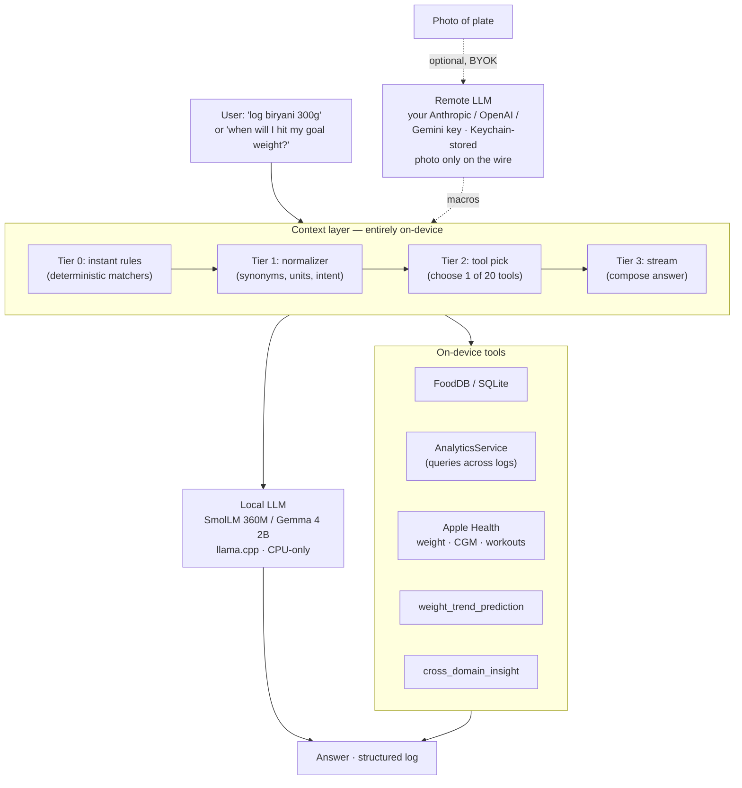

# The app that ships itself

*Notes on harness engineering for a one-person autonomous dev loop.*

---

If you've known me for a few years, you've watched me cycle through many health trackers on the App Store and explain my HRV at dinner to people who didn't ask. **Drift**, the iOS app I eventually built to replace all of that, is the natural endpoint — a personal app that a few friends ended up getting invested in too. They'd seen me geek out long enough about how sleep, heart rate, CGM glucose, and DEXA body-comp numbers correlate, and they trusted that if I was going to build a health app, I'd be obsessed enough to make it good. With language models democratizing the power of software to almost anyone, I couldn't not build it. A couple of friends adopted it as their primary tracker and each saved themselves a ~$20-a-month subscription elsewhere; since Drift runs entirely on the user's phone, my cost to keep any of it running is zero. In return, they find the subtle bugs I miss, push back on the places where the UI lacks taste, and every fix lands back as an improvement for all of us.

This post isn't really about Drift, though — or it is, in the way a post about a restaurant is about the kitchen. What I want to write about is the *kitchen*: the autonomous development loop I wired around a pair of language models to actually ship Drift, one iOS build at a time, without me at the stove.

Over the seven days before I sat down to write this, that loop pushed **409 commits** into Drift's repo. It shipped **nine features**. It closed **thirty distinct bug issues** — most of them filed by real beta users — resolving the shallower ones in an average of roughly eleven minutes. It ran **nine full product reviews**, studying competitors and telling me, the human, where I was falling behind. And it shipped **three TestFlight builds**.

I wrote none of that code. I read some of the reviews.

That's the interesting claim. Not *"I built an app."* Zero-to-one is now easy enough to stop being news. The claim is that a first-time iOS developer, working nights and weekends, can ship a production app by spending almost all of his engineering effort not on the app itself but on the **harness** — the scaffolding that directs the language models, catches their mistakes, keeps their work visible, and lets a human spend attention only on the things that genuinely need it.

The harness, in my experience, is the more interesting engineering. By a wide margin.

---

## Taste lives in the scaffolding

The thesis of this post, in a sentence: **taste lives in the scaffolding, and human attention is what it spends.**

If you've followed agentic coding at all, you've seen [Geoffrey Huntley's Ralph loop](https://ghuntley.com/ralph/) — a deliberately minimal `while true` around an AI coding agent that picks one task from a file, does it, exits, and starts a fresh process. Progress persists in git and files, not in the model's memory. It is elegant, and it has shipped real work overnight on meaningful budgets — one widely cited example delivered a ~$50K scope for under $300 in API costs. Ralph is the engine.

What I'm about to describe, **Drift Control**, is Ralph grown up. The inner loop is still a simple while-true. But around it is a layer of scaffolding — a supervisor tree, a domain-specific state machine, enforcement hooks, personas that accumulate taste, a dashboard I can read on my phone — that lets the loop run unattended not for hours, but for *weeks*. If Ralph is the engine, Drift Control is the engine plus the dashboard, the oil light, and the seatbelt.

Two observations became obvious after a few months of running this.

The first is that **the agent is not the product you own.** Models change. What persists is the harness: the queue, the hooks, the reconciliation, the dashboards, the test suite, the personas. If you pour your craft into clever prompts, you've invested in something a model update will subsume. If you pour it into the harness, it compounds. The model is a swappable component; the scaffolding is the asset.

The second is that **agents are a distributed-systems problem, not a language-model problem.** Every unglamorous distributed-systems pattern reappears, one at a time, the moment you let a language model run unsupervised — atomicity, idempotency, liveness, supervisor trees, partial failure, exactly-once semantics. The good news: these are half a century old and well understood. The bad news: most people building on agents haven't touched them since their systems-design interview. When something feels hard or weird about your agent, ask the systems question first — *"is this a race?"* *"what's my fencing token?"* — before the prompt question.

One more framing point, because it applies to both halves of this system. **Offloading a task to a bigger model is lazy.** You want a smart answer, you pay for a smarter model. The harder craft is the inverse: take a model that isn't especially smart, feed it the right context at the right moment, and watch it produce work that *looks* smart because the scaffolding did the heavy lifting. That principle shows up twice in Drift — once in the app (on-device models with a four-tier context pipeline) and once in the harness (hook-enforced ground-truth reconciliation that keeps ordinary Claude Code sessions honest). Same thesis, two instantiations.

And a final framing point: this is deliberately **not a general-purpose personal agent**. A "do anything for me" agent has no ground truth to reconcile against and no domain-shaped state machine to run on. Drift Control has one job (ship a specific iOS app). Git, GitHub, `xcodebuild`, and TestFlight are the anchors that make every pattern below possible. Narrow beats broad, for this class of system. At least with today's models.

---

## Drift, the app

This is the product half. If you want to skip straight to the harness principles, jump to *Ground truth over memory* below.

Drift is an iOS health tracker. I built it because every existing option fell short of what I actually wanted: an app that knew my food, my workouts, my weight, my mood, my sleep, and my glucose when I'm wearing a CGM, and that answered questions like *"when will I hit my goal weight?"* or *"does my glucose spike after rice?"* by chatting. I wanted natural-language logging — type or speak *"log breakfast: two eggs, toast, and coffee with milk,"* have the structured record appear. And I wanted all of that on my device. Not synced to some vendor's server that I could be cut off from. Not gated behind another $9.99-a-month subscription.

That last point matters to me more than it probably should. Look at what's happening to the App Store: one after another, health apps are becoming thin clients for cloud LLMs, charging monthly, putting the good features — conversational logging, photo scanning, chat insights — behind a paywall. The engineering is often a handful of pass-through calls to a frontier model provider. The subscription goes to the vendor. The privacy goes to the provider. I didn't want to add one more of those to my phone, and I didn't want to build one.

So Drift is a **no-"server" architecture.** No accounts. No subscriptions. No server to hold your data hostage. Drift is a client you run; the intelligence is whatever you configure it to use. The only backend is your phone.

That design constraint, concretely, meant fitting a language model into a phone. iPhones have finite memory — call it 6 GB on a reasonable modern device — and squeezing iOS plus a model into that envelope takes surgery. I picked **SmolLM (360M)** and **Gemma 4 (2B)** via `llama.cpp`, compiled for CPU-only (Metal is broken on A19 Pro as of this writing), with automatic model selection based on available memory and auto-unload after sixty seconds of idle. The context window is 2048 tokens, expanded to 4096 on devices with headroom.

A small model on a phone is not a smart model. That's the point. The smartness has to come from somewhere else — namely, the **context layer** that wraps it.



The context layer is where the actual engineering lives. Tier 0 handles instant, deterministic queries — the kind a regex can answer. Tier 1 normalizes the input: resolving synonyms, expanding abbreviations, picking units. Tier 2 chooses which tool to call from a registry of roughly twenty on-device tools (Food DB, AnalyticsService, Apple Health, a goal calculator, correlation tools, trend prediction). Tier 3 composes the answer and streams it back to the user. The LLM is consulted only when necessary, and never with more context than it needs. Most queries get answered by tiers 0–2 without the model seeing anything at all. By the time the model does run, the hard work — deciding what to look up, what to do with it — is already done.

That's why this works. A small model given the right five facts at the right moment behaves beautifully. A small model given twenty thousand tokens of noise does not, and no amount of clever prompting will save it. The scaffolding saves it.

There is one place in Drift where the cost/benefit genuinely favors a frontier model: **photo meal logging**. Point your camera at a plate, want macros and servings back — that's a task where a current on-device model cannot compete with Anthropic's, OpenAI's, or Google's vision. So Drift offers a **bring-your-own-key** path: you plug your existing Anthropic, OpenAI, or Gemini API key into Settings; it's stored in iOS Keychain; Drift talks to the provider directly from your phone; you pay the provider directly. No proxy. No vendor-in-the-middle subscription. Only the payload you chose to upload (the photo) goes on the wire — never your profile, history, or identity. If you'd rather not configure a key, photo logging is simply off, and the text and voice paths still work against the local model.

That's Drift at the product level. The pattern — *small model plus good context layer beats large model plus thin prompt* — is what I mean by taste living in the scaffolding. It is also exactly how the dev loop that ships Drift works.

---

## The same pattern, applied to the dev loop

The harness around Claude Code is not an elaborate multi-agent orchestration with judges and tournaments. It's ordinary language-model sessions, firing sequentially on my laptop — no sandboxes, no parallel worktrees — wrapped in enough scaffolding that ordinary sessions do production-grade work and correct themselves before the problems reach me.

The scaffolding is made of five principles, each learned the hard way.

---

## Principle 1 — Ground truth over memory

One Saturday I noticed the watchdog had run eleven consecutive planning sessions in four hours. Zero code shipped. The sessions kept firing *because the planning-due check was reading a stamp file that each session was supposed to write when it finished — and the sessions kept partially executing and dying before the stamp got written.* The harness was asking itself *"when did I last plan?"* and the answer was, forever, *"never."*

The rule I took from that incident: **if a language-model-driven session wrote it, I can't trust that it stayed true.** Sessions die, crash, run out of context, panic-exit. A stamp written by a session is a claim that depends on the session finishing cleanly, and sessions don't always finish cleanly.

The pattern: every gate in the watchdog loop now reconciles against an **external, durable store**. Not a local file an earlier session might have written. Not a cache. Git log or the GitHub API, every time.

| Gate | Old implementation | New implementation |
|---|---|---|
| Planning-due? | read stamp file | `git log --grep='planning complete'` |
| TestFlight-due? | read stamp file | `git log --grep='TestFlight build'` |
| What's in progress? | read local state | `gh issue list --label in-progress` |
| Report merged? | read stamp | `gh pr list --state merged --label report` |

It costs more in API calls. It's worth it. Git and GitHub are always right; my local cache might be stale; a session's in-memory belief is speculation. Pick the one that's always right.

---

## Principle 2 — Mechanical enforcement, not prose

If Principle 1 is about *what* you reconcile against, Principle 2 is about *how* you enforce.

The answer is: **not by writing rules in a prose file the agent reads.** The agent drifts from prose. Prose is a hint; the agent may or may not read it, and even if it does, "please don't do X" is one weight in a soup of many. What you want is *code that refuses to let the agent do X*. A gate that fails closed.

Drift's harness has about fifteen such hooks. The most important one is `require-claim`, a `PreToolUse` gate: if a senior or junior session tries to fire `Edit` or `Write` without holding a claim on a GitHub issue, the hook returns a deny signal and the tool call never runs. It doesn't matter what the session read in the program file. It doesn't matter what it thought it was doing. The gate doesn't negotiate.

Same shape for queue cap (`sprint-cap` refuses `gh issue create --label sprint-task` when the open queue is at or above 100 — because planning quality is inverse to queue size), for read-before-edit (every `Edit` on an unread file is refused), for TestFlight publishes (a pre-publish hook verifies build number and push target). Fifteen hooks, each under thirty lines of bash, each a chokepoint the session cannot route around.

The general principle: **documentation is a hint; a hook is a law.** Use laws for anything you'd be upset about if the agent broke it. When something goes wrong, you don't debug by rewriting a prompt — you tighten a hook.

---

## Principle 3 — Atomic claim makes work visible

Early on, I watched a senior session spend twenty minutes "investigating" a task. No `in-progress` label. No claim. No visible indication anywhere that it was working on anything. Eventually it crashed, and a second session spun up and picked up the same task from scratch. Classic **peek-without-claim** — the session had read the queue, decided what to do, but hadn't yet marked the task as taken. Between those two operations, anything can happen.

The pattern is distributed-systems 101: make the read-and-claim one atomic operation.

```bash
TASK=$(scripts/sprint-service.sh next --senior --claim)
```

One script call. Returns the next task *and* marks it `in-progress` on GitHub, under a single lock file. The caller never sees a task it was about to work on that wasn't already claimed. And the `require-claim` hook from Principle 2 finishes the job: no claim held, no `Edit` or `Write` fires. Ghost work becomes impossible.

Here's what that looks like end-to-end, on an actual bug from two days before I wrote this — issue **#220**.

A beta user filed a bug from inside Drift via the "Report Issue" flow. Title: *"Not able to edit ingredient list when I edit a recipe or meal from food diary."* Body, verbatim:

> *"Just lists down ingredients but no option to edit. Show the same view when it was added."*

Screenshot attached. The issue was filed at `13:24:57` UTC with a `P0` label.

The watchdog, which ticks every thirty seconds and reconciles against GitHub, noticed the new `P0-bug` on its next pass. Within a minute, a senior session spawned. It ran atomic `next --senior --claim`, got issue #220 back already marked `in-progress`. It read the full issue, screenshot included. It posted a plan comment first — a `PostToolUse` hook requires a plan comment before the first `Edit` — diagnosed the affected view, patched it, ran the unit tests, watched them pass, committed, pushed.

Eleven minutes and nineteen seconds after the issue was filed, at `13:36:16` UTC, GitHub's timeline shows the fix commit and the `in-progress → closed` transition, in that order.

I was walking the dog.

That kind of close happens three to ten times a week on shallow bugs. The ones that don't close that fast are the ones that need a design call or a product judgment — i.e., places where the bottleneck is me, not the loop. When I have an opinion, the harness waits for my comment. When I don't, it ships.

---

## Principle 4 — Tool calls are the pulse

Before I had a proper liveness signal, I was using log-file modification time as the check for *"is this session still alive?"*. It lied. During long generation bursts — the model thinking for ninety-plus seconds before producing any tool call — the log file didn't move. The watchdog kept concluding the session was stalled, killing it mid-thought, and wasting its work. I lost real progress that way more than once.

The fix is obvious in retrospect: **don't infer liveness, measure it.** A dedicated heartbeat that updates whenever the agent is actually doing something.

In Drift's harness, the heartbeat is three lines of bash, wired to both the `PreToolUse` and `PostToolUse` hooks — so it fires on every tool call, before and after:

```bash
#!/usr/bin/env bash
date +%s > ~/drift-state/session-heartbeat
echo "$(date +%s) $CLAUDE_TOOL_NAME" >> ~/drift-state/session-heartbeat.log
```

That's the entire signal. The watchdog reads that first file — not the log, not the process table — to decide whether the session is alive. Stale threshold: thirty minutes without a tool call. Tool calls, in other words, are the pulse. They are also, in practice, the only meaningful indicator of activity in a language-model agent — reasoning without a tool call is invisible by design, and a session that has gone silent for thirty minutes has almost certainly gotten stuck in a thinking loop rather than doing useful work.

The payoff is operational, but it changes how I live with the thing. Every ten minutes, a snapshot script bucketizes `session-heartbeat.log` into a JSON file, commits it, and pushes. The Command Center — a static HTML page on GitHub Pages — renders that JSON as an ECG strip:

```
Session heartbeat (last 4h)           Peak burst: 34 calls / 5 min
  ▁▁▁▂▂▃▄▅▅▆▇▇▆▅▄▃▂▁▁▁▂▃▄▅▆▇█▇▆▅▃▂▁▁▁▂
  │       senior start    senior done    │   planning
```

When I glance at my phone at 11 pm and the line is flat, I know. When it's moving, I go to bed. The thesis — *human attention is the scarce resource* — becomes concrete here: one glance, one answer, back to whatever I was doing. The liveness channel isn't for the harness, really. It's for the human. Its job is to let me *not* pay attention most of the time, and to make it cheap to pay attention when I want to.

One additional piece: **every supervisor needs a supervisor.** A session can crash; the watchdog restarts it. The watchdog itself can crash; nothing restarts it without help. So I wrap the watchdog in a `launchd` plist with `KeepAlive=true` and `ThrottleInterval=30`. If the watchdog exits for any reason — shell panic, Mac reboot, out-of-memory — launchd brings it back within thirty seconds. The supervisor tree goes all the way up until it hits the OS, which is the one thing I'm willing to trust not to die unnoticed.

---

## Principle 5 — The feedback loop is the architecture

The version of the harness I started with did not close its own feedback loop. When autopilot hit a systemic problem — a rate limit, a flaky test, a pattern the model kept repeating — I had to notice and fix it manually. That scales to roughly a weekend. Past a weekend, the harness itself needs to be learning.

The version in this repo does. Every planning session, as its first step, runs `issue-service.sh drain-feedback`: it reads issues labeled `process-feedback`, and if they describe systemic problems, converts them into `infra-improvement` tasks on the harness's own backlog. The harness fixes itself over time. When I hit a class of failure and file a one-liner with that label, the harness will find it and turn it into a task the same way it finds and turns feature requests into tasks.

But the sharper expression of this principle is in the **personas**. Two of them: a Product Designer and a Principal Engineer. They started as seed files I wrote in an afternoon. They have now been through fifty-four full product reviews, and every review ends with an appended block titled *"What I Learned — Review #N."* Those blocks stack up and become the context for every subsequent cycle. The personas develop taste. They remember past mistakes. They start pushing back on me when I'm wrong.

You can watch it happen. Here's the Designer in Review #11, about two hundred cycles ago, writing at the level of a fresh observation:

> *"Spent too many cycles on blanket code refactoring (code-improvement loop) instead of user-facing features. Merged into single autopilot loop."*

Useful, but surface-level. By Review #17 (cycle 620), the same persona is generalizing:

> *"Systematic bug hunting (running an analysis agent across pipeline files) found 4 silent data-accuracy bugs. This should be a quarterly ritual, not just reactive."*

By Review #54, last week, the Designer is making executive-level calls and quoting competitive intel back at me:

> *"Review #53 named them P0 for the very next senior session. They're still in queue. Whoop is now demonstrating exactly this pattern (Behavior Trends) to their 4M+ users. We built `cross_domain_insight` first — we have the pattern, the schema, and the service layer. Not shipping these two tools is a competitive mistake that compounds every cycle."*

The Engineer persona tracks the same arc, ending Review #54 with what is effectively a mini-RFC:

> *"For `supplement_insight` and `food_timing_insight`: the AnalyticsService infrastructure from `cross_domain_insight` is already there — implementation is 1–2 new service query methods plus schema. This can ship in a single senior session if scoped correctly."*

That's not a lessons-learned bullet. It knows the codebase. It scopes the work. It predicts what will ship in one session. And it got there not because I wrote a better prompt — I have never hand-edited the Engineer persona — but because every review stacks another paragraph of taste onto the file, and each subsequent cycle reads the accumulated file as context.

There's a minor governance structure inside these product reviews worth naming: **the two personas function as a minimal voting system.** They don't write the review jointly. Each one writes a *My Recommendation* block. Then there's a *The Debate* block where they argue — on the page, in the PR — and converge on an *Agreed Direction*. If they can't agree, the review ends with numbered *Decisions for Human* questions pinned to me. Here's a representative exchange from Review #54:

> **Designer:** *"The queue-cap was the right call six cycles ago and it's still right. We're at 101. Every new task added today is a task that will be 2,000 cycles old before it ships. I'm going to advocate for a hard rule: this planning session creates ≤4 new tasks — P0 bugs, mandatory eval run, and State.md refresh only."*
>
> **Engineer:** *"I support the spirit, but `program.md` requires 8+ tasks as DOD for this session. I don't want to create tasks for the sake of it — but there are two legitimate gaps that aren't in the current queue…"*
>
> **Agreed Direction:** *"Queue cap of 70 is re-affirmed — planning sessions creating >8 tasks when queue exceeds 70 are blocked. Senior execution drain rate is the only lever that matters for product velocity."*

Neither persona has unilateral authority. Neither one is me. And the point isn't the specific debate — it's that the harness has an *opinion of its own*, developed across fifty-four reviews, that converges before asking for my time. When it does ask, it asks three sharp questions in a block called *Decisions for Human*. I read that block in bed on my phone, tap approve on one, reply *"defer"* on another. The harness picks up my replies on the next planning cycle and adjusts.

That is what I mean when I say the feedback loop is the architecture. The harness isn't just shipping features — it is *studying the market, taking a position, defending the product, and educating me about what to prioritize*. When MyFitnessPal announced GLP-1 medication tracking recently, I didn't read about it in the tech press. I read about it in my own autopilot's PR, which had already formed an opinion on what it meant for Drift.

The direction all of this is pointing — and the part that is still only half-built — is a voting system with more than two voters. The personas are two. The A/B evals in the LLM harness are a small handful. The beta-user reactions on issues and exec-report PRs are a few dozen signals a week. Each of these is a vote. The next lever against the *human-attention bottleneck* is to let those votes — especially the handful of beta-user A/B signals on real features — become the real eval, so the harness can fix its own taste from users without me having to ratify every change. More on that in *What remains unresolved*.

---

## A week in the life, at a glance

Every principle above is distilled from actual traces the harness left behind. What follows is the seven-day trace from the week before I wrote this — a compact picture of what the thesis looks like in practice.

```
  Drift Control · last 7 days
  ─────────────────────────────────────────────
    409   commits pushed (0 written by me)
      9   features shipped
     30   distinct bug issues closed (most from beta users)
      9   product reviews (competitor studies)
      3   TestFlight builds published

  Session activity (tool-call heartbeat)
  ─────────────────────────────────────────────
  Mon  ▂▃▅▆▅▄▃▂▂▃▄▅▅▆▇▇▆▅▄▃▂▂▁▁
  Tue  ▁▂▃▄▅▆▇█▇▆▅▄▃▂▂▃▄▅▅▆▇▆▅▄
  Wed  ▂▃▄▅▆▆▅▄▃▂▂▃▄▅▆▇▇▆▅▄▃▂▁▁
  Thu  ▁▂▃▅▆▇▇▆▅▄▃▃▄▅▆▆▅▄▃▂▂▁▁▁
  Fri  ▂▃▄▅▆▆▅▄▃▃▄▅▆▇▇▆▅▄▃▂▂▁▁▁
  Sat  ▁▁▂▃▄▅▆▆▅▄▃▂▂▃▄▄▃▃▂▂▁▁▁▁
  Sun  ▁▂▃▄▅▅▄▃▂▂▁▁▂▃▄▅▆▆▅▄▃▂▁▁
       0   4   8  12  16  20  24  (UTC hours)

  Notable events
  ─────────────────────────────────────────────
  Mon  bug #220 filed by a beta user → closed 11m19s later
  Tue  TestFlight build 170 auto-published
  Wed  product review #54 — Designer flags two queued features
       as a compounding competitive risk vs Whoop
  Thu  five-bug bundle from photo-log screenshots (single commit)
  Sat  eleven planning sessions fire in four hours
       (the failure that became Principle 1)
```

Three sentences to tie it together: I did no code work that week. I read five of the exec reports, approved one design, and left two comments on the product review. The rest ran itself.

---

## The dial I actually turn

One question I keep getting: *how do you steer this thing, exactly?*

The answer isn't one lever. It's a dial with roughly six settings, from *"don't touch it"* to *"take the wheel."* Most days I use the light ones.

| Setting | What I do | What the harness does |
|---|---|---|
| **0. Nothing** | Close the laptop. | Reads the roadmap, runs product reviews, learns from past cycles, picks the next thing from its own backlog. **Comes up with features on its own taste** — the one that accumulated across fifty-four reviews — and ships them. Defaults are usually fine. |
| **1. Strategic nudge** | One-line comment on a product-review PR: *"focus on food-DB coverage this week."* | Next planning session treats it as a priority signal. No rewrite of anything. |
| **2. Design-review request** | Add a `design-doc` label to an issue. | Senior session writes a design doc on a branch, PRs it, waits for my comment. Implementation only starts after I approve. |
| **3. Feature request** | File a GitHub issue with `feature-request` + one paragraph of intent. | Planning triages it into the sprint as P0/P1 or labels it `deferred`. I don't pre-specify files or approach. |
| **4. P0 bug** | Filed with a `P0` label, usually from a beta user. | Interrupts on the next tick, picks it up on the senior session. The eleven-minute flow in Principle 3. |
| **5. Take the wheel** | `echo PAUSE > ~/drift-control.txt`, open Claude Code in human-shepherded mode, type. | Stops spawning sessions. Session-start hook detects human mode and suppresses auto-publish. `echo RUN` resumes the loop. |

The counterintuitive part: **the lighter the intervention, the more the personas compound.** If I stay at setting 4 or 5, the harness doesn't learn what I actually want — it just executes. If I stay at 0 or 1, it drifts toward what the market is signaling, which is usually right but occasionally misses my taste. Setting 2 — design-review request — has become what I use most often for anything I actually care about shaping. Most of my product decisions now happen by reading a design PR and leaving two comments.

The point of the harness isn't that it's autonomous. It's that it lets me be *selective about where I pay attention.*

---

## What remains unresolved

A few pieces are open problems. I'm writing about them because the essay would be dishonest without them.

**Parallelism.** Sessions fire sequentially on one laptop. I looked at parallel agents — separate git worktrees, isolated simulators, a scheduler — and concluded the reliability tax was not worth it for an app Drift's size. `xcodebuild` and the simulator are hostile to concurrency. Sequential is simpler, observable, and good enough. That conclusion will probably invert once the throughput becomes the bottleneck, and I don't have a good design for the parallel version yet.

**Multi-repo generalization.** The whole harness is Drift-specific in a lot of small ways — the testing cadence assumes Xcode, the TestFlight hook assumes an iOS build, the persona files assume a health app. I think most of it generalizes, but I haven't ported it to a second project, so I don't really know which pieces are portable and which are load-bearing in ways I haven't noticed.

**The voting system.** The personas already act as a two-voter body (Designer and Engineer, debating and converging). The LLM eval harness is another small body of voters — a handful of golden prompts that a release has to pass. Beta users, via thumbs-up reactions on issues, via direct bug reports, via a small number of in-app prompts asking *"is this answer right?"*, are yet another body. Today those signals feed back informally: I read reactions and nudge the harness with a comment. The direction I want to push this is to formalize it — a handful of A/B-tested changes per cycle, scored by real beta-user votes, fed back into the planning signal as ground truth. The premise is the same as the rest of the essay: *human attention and taste are the bottleneck,* and the fastest way to loosen that bottleneck is to let a handful of real users' A/B votes become the actual eval, so the harness can fix its taste from users rather than from me. It is in the plan. It is not yet in the repo.

**The class of work the loop still can't do.** Shallow bugs, yes. Scoped refactors, yes. Product direction calls, no. Anything that requires taste I haven't externalized into a persona or a hook still falls on me, and the bottleneck is exactly there. The honest way to say this: the harness has raised the floor of what ships while I'm asleep. It has not yet raised the ceiling of what I can design when I'm awake.

---

## Replicate it

Everything is zipped at [`drift-command-center-replicate.zip`](./drift-command-center-replicate.zip) in this folder:

- `program.md` — the autopilot program the watchdog drives
- `.claude/settings.json` + `.claude/hooks/*.sh` — every enforcement hook (`require-claim`, `sprint-cap`, `session-heartbeat`, `guard-testflight`, `pause-gate`, …)
- `scripts/self-improve-watchdog.sh` — the watchdog
- `scripts/sprint-service.sh`, `planning-service.sh`, `issue-service.sh`, `design-service.sh`, `report-service.sh` — the state-machine CLIs the sessions call
- `scripts/session-monitor.sh` — live summaries via a smaller model
- `scripts/heartbeat-snapshot.sh` — log → JSON for the dashboard
- `scripts/install-watchdog.sh` + `com.drift.watchdog.plist` — launchd supervision
- `command-center/` — the dashboard (static HTML/JS)
- `REPLICATE.md` — one-page quickstart for adapting it to a different repo

It isn't a framework. It's a kit. Cut and paste what you need, replace the Drift-specific bits, keep the shape.

---

*Drift is in TestFlight with twenty-five beta users. The code is at [github.com/ashish-sadh/Drift](https://github.com/ashish-sadh/Drift). This harness has shipped roughly 170 builds of it, and by the time you read this, probably more. I did not write the iOS code. I don't want to pretend otherwise. What I did build is the kitchen — the engine, the dashboard, the oil light, and the seatbelt — and that is the part I think is worth sharing.*
